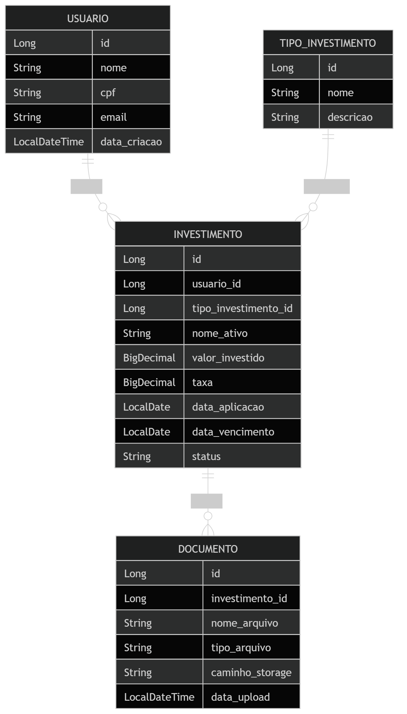

# Financial Investment API

Proof of Concept (POC) de uma API REST para gerenciamento de investimentos financeiros de usuários.

O objetivo do projeto é exercitar modelagem de domínio, organização de arquitetura em Spring Boot e construção de endpoints REST.

---

# Tecnologias

* Java 17+
* Spring Boot
* Spring Web
* Spring Data JPA
* PostgreSQL
* Maven

---

# Arquitetura do projeto

Organização **package-by-feature**, agrupando cada domínio da aplicação.

```
com.debora.investment

config
exception
shared

usuario
    controller
    service
    repository
    entity
    dto

investimento
    controller
    service
    repository
    entity
    dto

documento
    controller
    service
    repository
    entity
    dto
```

Essa abordagem facilita manutenção e evolução do sistema, pois cada módulo contém todos os componentes relacionados ao domínio.

---

# Modelo de domínio inicial

O sistema modela três conceitos principais:

* **Usuário**: investidor da plataforma
* **Investimento**: aplicação financeira realizada pelo usuário
* **Documento**: arquivos associados ao investimento (ex: comprovante)


## Diagrama de domínio



---

# Endpoint inicial

Criar um investimento.

```
POST /investimentos
```

Exemplo de request:

```json
{
  "usuarioId": 1,
  "tipo": "TESOURO_DIRETO",
  "nomeAtivo": "Tesouro Selic 2029",
  "valor": 1000,
  "dataAplicacao": "2026-03-12"
}
```

---

# Como executar o projeto

### Clonar repositório

```
git clone https://github.com/seu-usuario/investment-api.git
```

### Entrar na pasta

```
cd investment-api
```

### Rodar aplicação

```
mvn spring-boot:run
```

---

# Roadmap / Tarefas

### Estrutura inicial

* [ ] Criar projeto Spring Boot
* [ ] Configurar estrutura de pacotes
* [ ] Configurar conexão com banco

### Modelagem

* [ ] Criar entidade Usuario
* [ ] Criar entidade Investimento
* [ ] Criar entidade Documento
* [ ] Criar repositórios JPA

### API

* [ ] Criar endpoint POST investimento
* [ ] Criar endpoint GET investimentos por usuário
* [ ] Criar endpoint GET investimento por id

### Documentos

* [ ] Criar endpoint upload de documento
* [ ] Criar endpoint download de documento

### Qualidade

* [ ] Criar testes unitários
* [ ] Adicionar documentação Swagger

---

# Objetivo do projeto

Este projeto foi criado para estudo e prática de:

* Desenvolvimento de APIs REST com Spring Boot
* Modelagem de domínio
* Organização de arquitetura backend
* Boas práticas de desenvolvimento em Java
